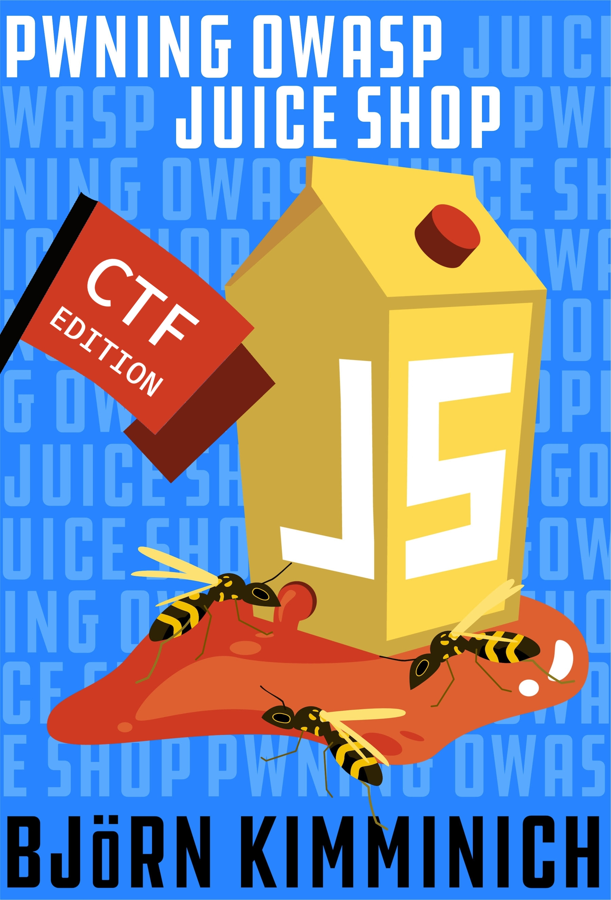
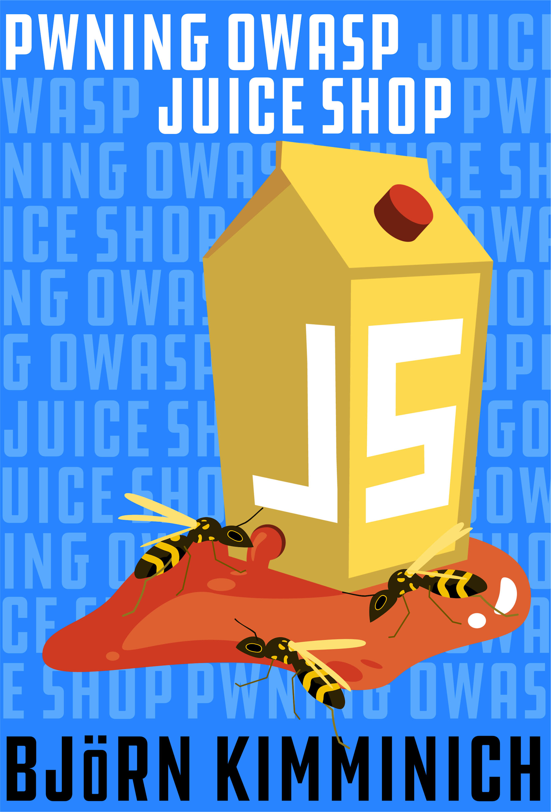



# Pwning OWASP Juice Shop (CTF Edition)



# Pwning OWASP Juice Shop



Written by [Björn Kimminich](https://twitter.com/bkimminich)

Traducido al español por Carlos Alendes y Kevin Eliezer.







Esta es la guía oficial de __OWASP Juice Shop__. Partiendo de una aplicación web con una enorme cantidad de fallos de seguridad,
OWASP Juice Shop se supone que es lo opuesto a _las buenas prácticas_ o a una _aplicación de plantilla_ para los desarrolladores web: 
se trata de una herramienta de consciencia, aprendizaje, demostración y entrenamiento para fallos de seguridad en las aplicaciones 
webs modernas. OWASP Juice Shop es un proyecto open-source alojado en OWASP Open Web Application Security Project y se sigue desarrollando y manteniendo gracias al trabajo de voluntarios.
El contenido de este libro fue escrito para la versión {{book.juiceShopVersion}} de OWASP Juice Shop.

Este libro se divide en tres partes:

### Parte I - Preparación

La primera parte te ayudará a lograr a poner la aplicación en funcionamiento y, de forma opcional, instalar herramientas de hacking.

### Parte II - Cazando retos

La segunda parte da una visión general de las vulnerabilidades que se 
pueden encontrar en OWASP Juice Shop, incluso pistas de cómo localizarlas
y explotarlas dentro de la aplicación.

### Part III - Involúcrate 



Part three points you to the social media channels and tells you about
donation options of the OWASP Juice Shop open source project.



La tercera parte te muestra varias formas de contribuir al proyecto open source
OWASP Juice Shop.

----

_Sea consciente de que este libro no pretende ser un libro de introducción a 
la seguridad de aplicaciones web. Encontrarás una breve explicación para cada
tipo de vulnerabilidad presente en OWASP Juice Shop - típicamente citando y
referenciando el contenido ya existente sobre el tema dado._

----

__Descarga el .pdf, .epub, o .mobi file en:__

* https://leanpub.com/juice-shop (official release)
* https://www.gitbook.com/book/bkimminich/pwning-owasp-juice-shop

__Lee el libro online en:__

* https://bkimminich.gitbooks.io/pwning-owasp-juice-shop/content

__Contribuye, sugiere y/o reporta errores en GitHub:__

* https://github.com/bkimminich/pwning-juice-shop

__Página oficial de OWASP Juice Shop:__

* http://owasp-juice.shop



----

Esta obra se encuentra bajo una licencia
[Creative Commons Attribution-NonCommercial-NoDerivatives 4.0 International License](https://creativecommons.org/licenses/by-nc-nd/4.0/).
