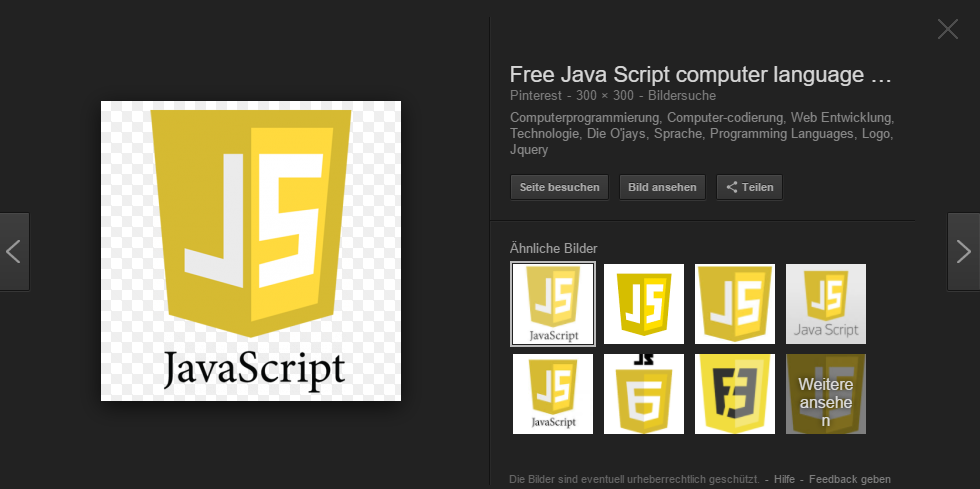
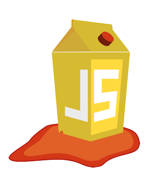
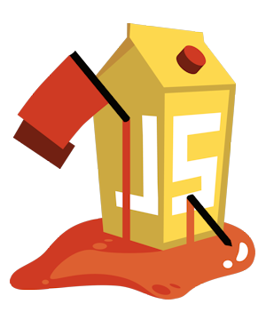

# ¿Por qué existe Juice Shop?

Para el usuario despistado, Juice Shop es simplemente una pequeña tienda online que vende 
_¡sorpresa!_ - jugo de fruta y verdura y otros productos asociados. Exceptuando por los
elevados pagos y el aspecto de entrega del negocio e-commerce, Juice Shop es completamente
funcional. Pero esto es solo la punta del iceberg. Juice Shop contiene {{book.juiceShopNumberOfChallenges}}
desafíos de dificultad variada donde debes explotar fallos de seguridad. Estas vulnerabilidades 
fueron implementadas de forma intencionada en la aplicación para este propósito, pero de una 
manera que simula lo que ocurre en desarrollo de webs de la vida real.

La aplicación realiza un seguimiento de tu progreso utilizando notificaciones cuando 
logras explotaciones exitosas y contiene un tablero de puntuaciones para consultar tu
progreso. ¡Encontrar el tablero de puntuaciones es uno de los retos más fáciles! La idea
detrás de esto es utilizar técnicas de [gamificación](https://es.wikipedia.org/wiki/Ludificaci%C3%B3n)
para motivarte a lograr la mayor cantidad de retos resueltos como sea posible - algo similar a desbloquear
logros en los videojuegos modernos.

El desarrollo de Juice Shop comenzó en septiembre de 2014 como una iniciativa personal de los
autores, cuando un entorno de prácticas para aplicaciones web más moderno era necesario.
Antes, los entornos de prácticas eran todavía  lado del servidor con tecnologías de la 
era ASP/JSP/Servlet y no reflejaban la realidad de la tecnología web actual. Juice shop fue
desarrollado como un software open source sin incorporar ninguna marca desde el inicio. 
Hasta finales de 2014, la mayoría de la actual funcionalidad e-commerce ya estaba funcionando 
junto a un número inicial de vulnerabilidades planteadas. Con los años, más variedad de 
vulnerabilidades fueron añadidas. En paralelo, la aplicación se ha seguido manteniendo actualizada 
con lo último de la tecnología web (p.e. WebSockets y OAuth 2.0) and frontend frameworks (es decir, 
migrando desde AngularJS con Bootstrap a Angular con Material Design). Algunos de estas incorporaciones
dieron la posibilidad de añadir nuevas vulnerabilidades - y así la lista de retos ha seguido creciendo 
desde ese entonces.

Aparte del hacker y la concienciación, las herramientas de penetración y los escáneres automatizados 
de seguridad fueron invitados a usar Juice Shop como un tipo de aplicación de "conejillo de indias" 
para comprobar cómo y cuánto de bien hacía frente sus producto a las aplicaciones pesadas de Javascript
 y las API REST.

### ¿Por qué _OWASP_ Juice Shop?

> Cada tecnología necesita una fuente de información imparcial con 
> las mejores prácticas, así como un cuerpo activo que abogue 
> por los estándares abiertos. Dentro de la seguridad de aplicaciones, 
> uno de estos grupos es the Open Web Application Security Project (o OWASP abreviado).
>
> The Open Web Application Security Project (OWASP) es una 501(c)(3)
> organización mundial sin ánimo de lucro enfocada en mejorar 
> la seguridad del software. Nuestra mision es hacer la seguridad 
> del software visible, así personas y organizaciones pueden tomar decisiones informadas.
> OWASP está en una posición única para proveer de información 
> imparcial y práctica sobre la seguridad de aplicaciones a individuos, 
> universidades, agencias gubernamentales y otras organizaciones 
> del mundo entero.
> Operando como una comunidad de profesionales con ideas afines, 
> OWASP crea herramientas software y documentación basada en 
> el conocimiento de la seguridad de aplicaciones.[^1]

Dos años después de su inicio, Juice Shop fue presentado y aceptado como un _OWASP Tool Project_
(un proyecto de herramienta, por [Open Web Application Security Project](https://owasp.org) en septiembre
de 2016\. Esto incrementó la visibilidad general del proyecto y mejoró significativamente su alcance, ya
que se expuso ante una gran comunidad de personas dedicadas a la seguridad de las aplicaciones.

Una vez en el portfolio de proyectos OWASP, solo llevó ocho meses hasta que Juice Shop fue ascendido 
desde el nivel de madurez inicial _Incubadora_ hasta el nivel _Proyectos de laboratorio_. A finales 
de julio de 2018, Juice Shop pasó al estado final de madurez _Flagship_ para los proyectos OWASP.

### ¿Por qué "Juice Shop" como nombre?

En alemán, hay una palabra dedicada para _dump_: una tienda que vende 
productos de mala calidad y no tiene en cuenta la satisfacción del cliente 
como una prioridad: _Saftladen_. Traducciendo esto por separado, Saft y Laden 
significan _juice_ (jugo) y _shop_ (tienda) en Inglés. De ahí es donde proviene 
el nombre del proyecto. El hecho de que las iniciales JS coincidan, siendo 
estas comunmente utilizadas para referenciar _JavaScript_, fue puramente una
 coincidencia y no estaba relacionado con la elección de la tecnología a implementar.

### ¿Por qué este logo?

Aparte del nombre, el logo de Juice Shop fue diseñado explícitamente con _JavaScript_ en mente:

La idea de los autores era convertir uno de los (no oficial, pero popular) logos de escudo 
de _JavaScript_ en un **tetrabrik de jugo goteante** porque la forma coincidía bastante y
daba mucho juego en el proyecto:

En 2017, el logo recibió un lavado de cara y un spin-off cuando se le introdujo a Juice Shop 
la extensión Capture-the-flag (que se comenta en el capítulo [Organizando un evento CTF](../part1/ctf.md)):

### ¿Por qué otra aplicación web vulnerable?

Un número considerable de aplicaciones web vulnerables ya
existían antes de que Juice Shop fuera creada. [OWASP Vulnerable 
Web Applications Directory (VWAD)](https://www.owasp.org/index.php/OWASP_Vulnerable_Web_Applications_Directory_Project) 
mantiene una lista de estas aplicaciones. Cuando Juice Shop nació, había 
solo una aplicación _redenrizada por el lado del servidor_ en la VWAD. 
Pero aplicaciones del estilo  _Rich Internet Application (RIA)_ or
_Single Page Application (SPA)_ ya eran un producto en ese momento. 
Juice Shop estaba destinado a llenar ese vacío.

Mucha de las existentes páginas webs vulnerables eran muy rudimentarias
en su aspecto funcional. Así que el objetivo de Juice Shop era dar 
una impresión de una funcionalidad completa de aplicación e-commerce 
que pudiera existir en la actualidad en Internet.

[^1]: https://www.owasp.org
